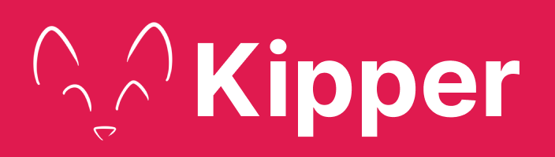

---

Project marked as completed on the 20th June 2022.

Website Development will still continue though alongside Kipper and serve as its documentation page.

---

## Goals

- Provide simple and straight-forward documentation on the programming language.
- Provide an interactive code-editor and online compiler for using Kipper online.
- Have a simple, organised and well-designed Homepage, providing info on the project and Kipper itself.

## Timeline

- Until 17th October: Grammar file and project setup for Kipper finished ✓
- Until 16th January: Finished CSS and HTML on the Website ✓
- Until End of Winter Semester: Finish design of Website and complete Static (HTML) Part of the Website ✓
- Until Summer Semester: Finished Online Compiler (Playground) of Kipper ✓

## Team-Members

- Luna Klatzer (Team-Lead): Main Developer for the programming language and interactive editor (Mainly JS/TS)
- Maximilian Seebacher: Main Developer for the Website and design (Mainly CSS, HTML)
